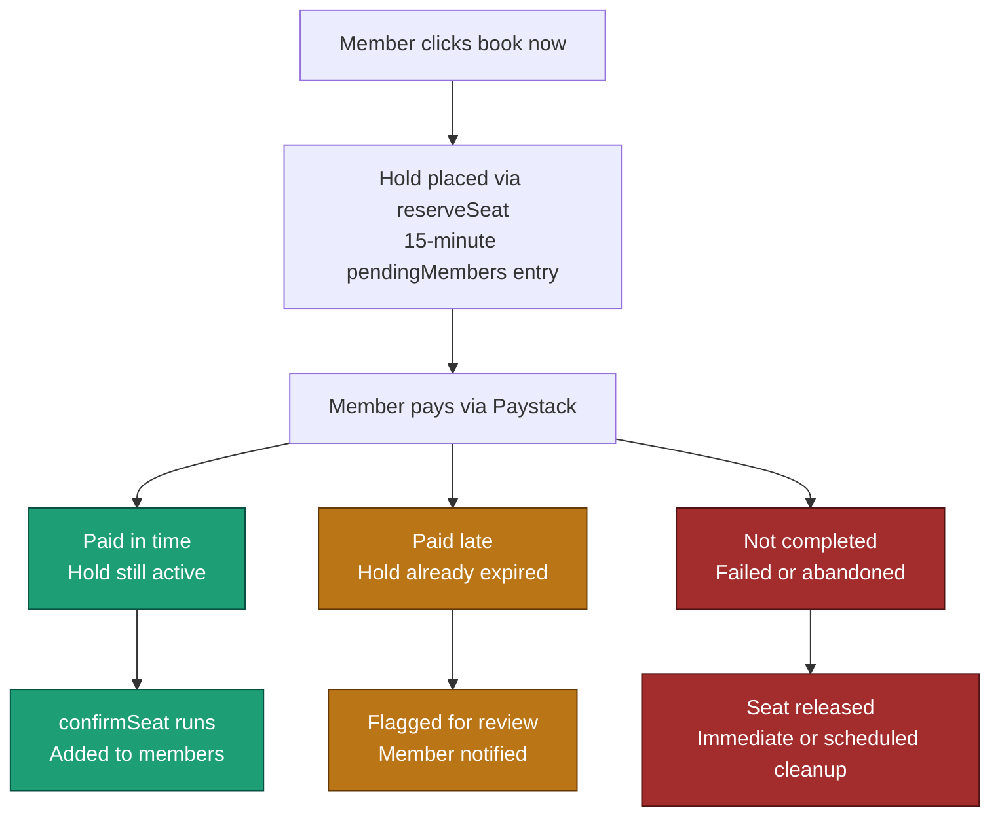

## Seat reservation flow

```mermaid
flowchart TD
    A[Member clicks book now] --> B["Hold placed via reserveSeat<br/>15-minute pendingMembers entry"]
    B --> C[Member pays via Paystack]
    C --> D["Paid in time<br/>Hold still active"]
    C --> E["Paid late<br/>Hold already expired"]
    C --> F["Not completed<br/>Failed or abandoned"]
    D --> G["confirmSeat runs<br/>Added to members"]
    E --> H["Flagged for review<br/>Member notified"]
    F --> I["Seat released<br/>Immediate or scheduled cleanup"]

    classDef success fill:#1D9E75,stroke:#085041,color:#fff
    classDef warning fill:#BA7517,stroke:#633806,color:#fff
    classDef danger fill:#A32D2D,stroke:#501313,color:#fff

    class D,G success
    class E,H warning
    class F,I danger
```
